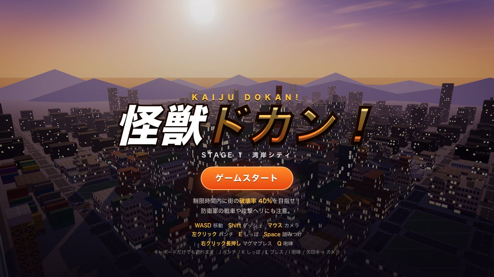
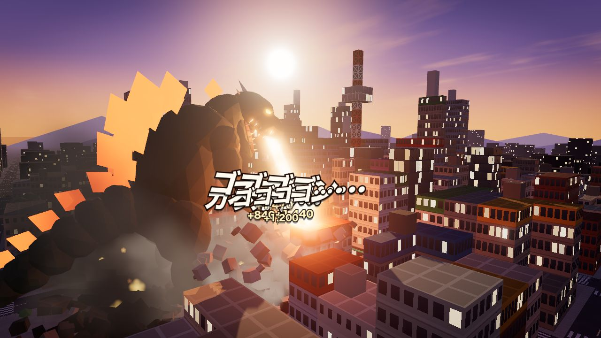
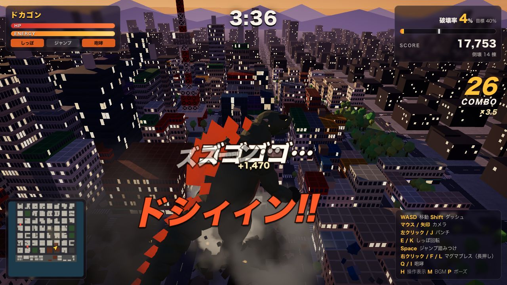

# 怪獣ドカン！ KAIJU DOKAN!

巨大怪獣「ドカゴン」を操作して、夕暮れの湾岸シティをドカンドカン破壊するブラウザゲームです。
Three.js + TypeScript 製。グラフィックも効果音も BGM もすべてコードで生成していて、外部の画像・音声ファイルは使っていません。

**▶ ブラウザで遊ぶ：[https://tanuu5.github.io/kaiju-dokan/](https://tanuu5.github.io/kaiju-dokan/)**
（インストール不要。PC のブラウザで、マウス＋キーボードで遊べます）







## 遊び方

- **目的**：制限時間 4 分以内に、街の破壊率 40% を達成するとステージクリア。クリア後も時間いっぱい暴れてスコアを伸ばせます（Enter で終了）。
- **ビルの壊れ方**：ビルは 1 フロアずつのブロックでできていて、攻撃した場所だけが崩れます。土台を崩すとビルが倒壊し、背の高いビルは隣のビルを巻き込みながら横倒しになります。
- **コンボ**：破壊を続けるとコンボがつながり、スコア倍率が最大 ×5 まで上がります。
- **エネルギー**：破壊するとエネルギーが溜まり、マグマブレスが撃てます。満タンになると背びれが光ります。
- **防衛軍**：時間が経つと戦車や攻撃ヘリが攻撃してきます。踏みつけ・パンチ・しっぽ・ブレスで撃破できます。咆哮でヘリをひるませることもできます。
- **HP**：HP が 0 になるとゲームオーバー。しばらく被弾しなければ回復し、ビルを倒すと少し回復します。

## 操作方法

| 操作 | キーボード＋マウス | キーボードのみ |
| --- | --- | --- |
| 移動 / ダッシュ | WASD / Shift | WASD / Shift |
| カメラ | マウス（画面クリックでマウス操作に戻る） | 矢印キー |
| ズーム | マウスホイール | – |
| パンチ（連打すると 3 発目が叩きつけ） | 左クリック | J |
| しっぽ回転アタック | E | K |
| ジャンプ → 着地で踏みつけ | Space | Space |
| マグマブレス（長押し・エネルギー消費） | 右クリック長押し / F | L |
| 咆哮（ヘリをひるませ、車を吹き飛ばす） | Q | I |
| ポーズ | Esc / P | P |
| BGM 切り替え / 操作表示の切り替え | M / H | M / H |

## 動作環境

- WebGL2 に対応したデスクトップブラウザ（Chrome / Edge / Firefox / Safari の最新版）
- マウス＋キーボード推奨（スマホ・タブレットのタッチ操作は未対応）
- 動作が重いときは URL の末尾に `?quality=low` を付けると軽量モードになります（解像度と影の品質を下げます）

## 開発

```bash
npm install
npm run dev      # 開発サーバー（http://localhost:5173）
npm run build    # 型チェック + 本番ビルド（dist/）
npm test         # ユニットテスト + ヘッドレスシミュレーション
npm run sim      # Bot にステージを通しでプレイさせるバランスレポート
npm run check    # 型チェック・テスト・ビルドをまとめて実行
```

- URL に `?debug` を付けると FPS などのデバッグ表示が出て、ブラウザのコンソールから `window.__game` にアクセスできます。
- ゲームのルール部分（`src/game/session.ts`）は DOM や WebGL に依存していないので、Node 上でシミュレーションできます（`tests/sim.test.ts`）。

## 技術的なしくみ

- **建物**：4m 四方のブロック（チャンク）の集まり。街全体のブロックを 1 つの InstancedMesh で描画し、破壊・支持判定（地面とつながっていない部分の落下）・倒壊（沈み込み／横倒し）を CPU で計算しています。
- **見た目**：窓・道路・空・海はシェーダーで手続き生成。夕暮れのライティングにブルームを重ねています。怪獣がビルに隠れたときはステンシルで透視シルエットを表示します。
- **音**：足音・爆発・崩落・咆哮・BGM（太鼓とベースのループ）を Web Audio API で合成しています。
- **使用技術**：Three.js、TypeScript、Vite、Vitest

## ディレクトリ構成

```
src/
  main.ts            エントリーポイント
  config.ts          チューニング用の定数
  stages/            ステージ定義（制限時間・目標・敵ウェーブ）
  game/              ゲーム本体（Game: 画面と描画 / Session: ルール / World: 3D オブジェクト一式）
  world/             都市の生成、建物の破壊、破片、地面・空・海、車、街路樹
  entities/          怪獣、防衛軍
  fx/                パーティクル、ブレス、擬音語テキスト
  ui/                HUD、ミニマップ
  core/              入力、音、乱数、数学ユーティリティ
  sim/               ヘッドレスシミュレーション用の Bot
tests/               ユニットテストとシミュレーション
docs/images/         README 用のスクリーンショット
```

## ライセンス

[MIT License](LICENSE) © 2026 たぬ
